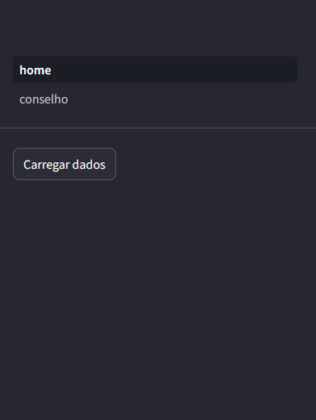
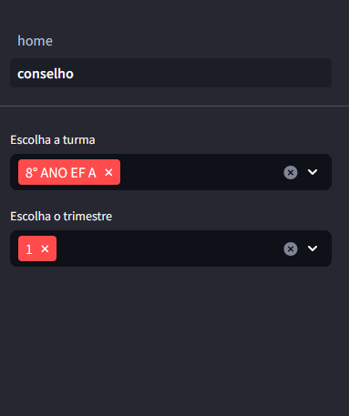
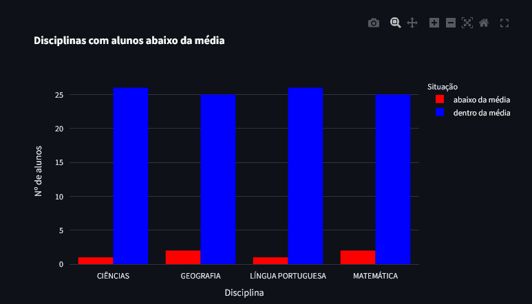
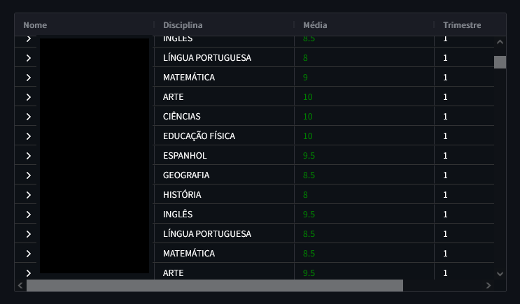
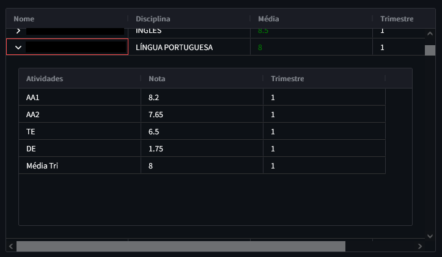
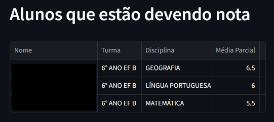

# Dashboard Análises Pedagógicas 📚📈

Esse painel tem a finalidade de auxiliar a Coordenação Pedagógica em rotinas do dia a dia ou que antecedem fechamento de trimestre, onde é necessário, por exemplo, saber quais
alunos ficaram de recuperação e/ou quais alunos tem chance de ficarem retidos ou estão devendo nota.

Listo abaixo as funcionalidades e procedimentos de uso

## Home

É na home que é feito o carregamento dos dados. Aqui são geradas todas as planilhas necessárias para a produção
do Dashboard. Essas planilhas são obtidas Por meio de views que acessam a base de dados. 

## Conselho

Se escolhe uma turma e o trimestre. 

Esses inputs vão confeccionar o seguinte gráfico:

Logo abaixo do gráfico há uma tabela com as notas de media. Caso queira saber as notas parciais, basta clicar na
seta ao lado do nome do aluno para expandir.

A última tabela mostra os alunos que estão devendo nota. 

